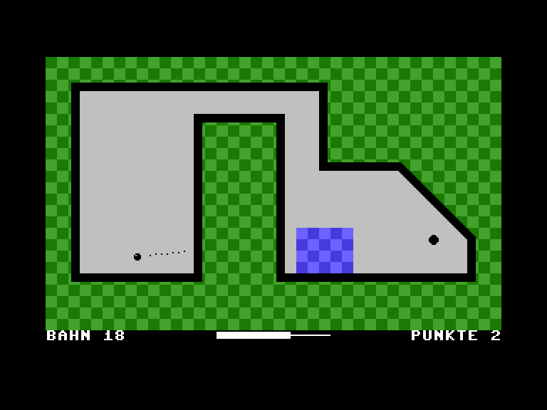

# C16 Minigolf



Minigolf für den Commodore 16 mit 16 KB RAM: 320×200 im Textmodus,
Draufsicht und pixelgenaue Ballphysik. Eine Runde hat 18 Bahnen, einige mit Wasser. Joystick an Port 1.

Im Browser spielen: https://phausser.github.io/c16-minigolf/

## Bauen und starten

Voraussetzungen: ACME 0.97 oder neuer, Make und Python 3.
Zum Spielen im Emulator: VICE xplus4 mit C16-ROMs.

```sh
make
make run
```

## Lizenz

MIT, siehe [LICENSE](LICENSE).
